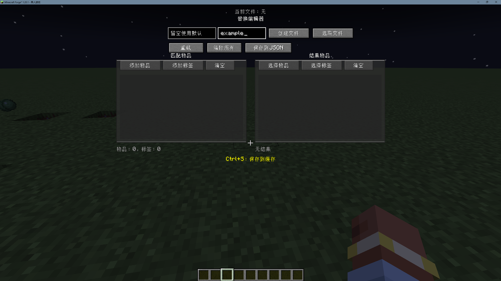
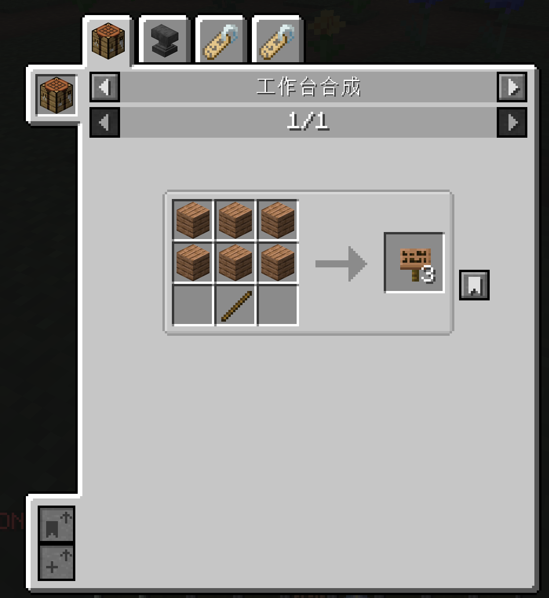

## OneEnoughItem

### 概述
OneEnoughItem 模组的可视化编辑界面教学。

### 开始
按下绑定的快捷键（默认为 Ctrl + R）打开可视化编辑界面，R键若有冲突可更改。 

---

若还没创建数据包，在左边的输入框输入你想创建的数据包名称（可留空，默认为OEI），右边的输入框中输入你想创建的 json 文件名称，输入完成后点击创建文件按钮，就会自动在

> <存档名称>/datapacks/<数据包名称>/data/oei/replacements

文件夹下创建数据包json文件。


---

若有数据包，则可以点击选取文件按钮，点击你想进行操作的文件条目，会有三个按钮：

- **添加**：顾名思义添加内容；
- **更改**：进行这项操作，编辑界面左上角会有选择数组元素按钮，若数据包有多个json数组：
```json
[
    {
        "matchItems": [
            "#forge:ores"
        ],
        "resultItems": "minecraft:egg"
    },
    {
        "matchItems": [
            "minecraft:stone"
        ],
        "resultItems": "minecraft:air"
    }
]
```
此文件分两个部分，第一部分是数组序列1， 第二部分就是数组序列2。以此类推，选择你想更改的部分可随意修改保存。

---

### 扩展（实验性功能）
若安装了 [Kubejs](https://www.curseforge.com/minecraft/mc-mods/kubejs) 模组，在编辑界面会多出一个配方去重按钮。

由于我们替换物品后，有管原物品的配方也会跟着过来，如下：

**这是将盔甲标签替换为了从林木告示牌。**

**但当你点击配方去重按钮后**，会根据当前选中文件json中包含的替换规则来生成移除配方的kjs脚本，看到移除成功的信息后即可重载使其生效，如下：

**注：铁砧暂时无法搞定。**

---

应该也没什么介绍的了，剩下几个注意事项：

- 记得常按 Ctrl + S 进行缓存处理，这样退出界面/切换界面什么的不会丢失数据。
- 界面尺寸最好用4及以上，不然有些按钮会点不到。
- 配方去重功能为实验性功能，很多Bug还是未知项，请遵循规则：
>等到将所有想替换完的物品替换完成后，再进行配方去重，不然临时更改可能会出问题
- 在Fabric/Neoforge环境中，创造模式物品栏看不到被替换后的物品是正常现象；Forge环境有时替换Tag也会出现此现象，但不会影响正常功能，重启游戏即可。
- 不要进行奇怪操作，如嵌套替换、Tag作为结果项（编辑界面已禁止，如果你非要手写进行上述操作，那你赢了。）